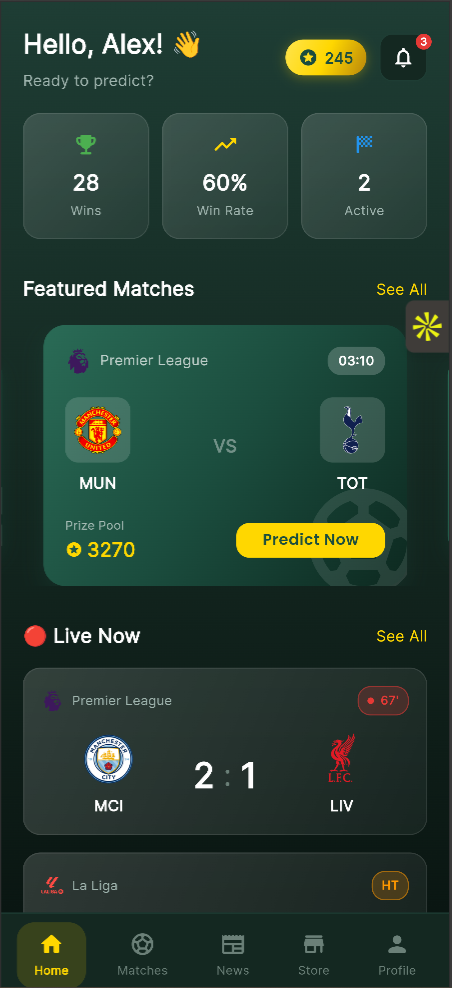
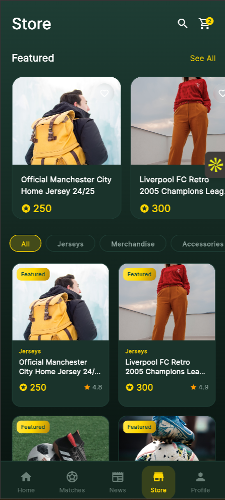
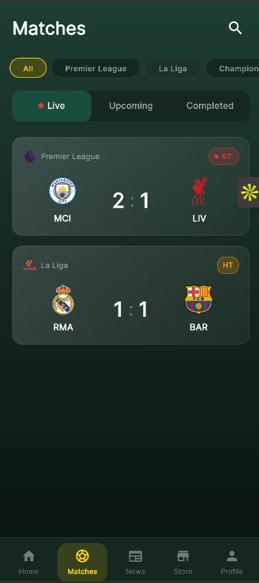

<div align="center">

# ⚽ Skoor — Predict. Compete. Win.

**A data-driven football predictions platform where fans stake Scholar Coins, climb leaderboards, and redeem rewards.**

[](https://flutter.dev)
[](https://dart.dev)
[](LICENSE)
[]()
[]()

[https://skoor-prototype.vercel.app/]

---
##### Home Page


##### Merchandise Page


##### Matches Page


</div>

## 📌 What is Skoor?

Skoor turns passive football watching into an **active, rewarding experience**. Users predict match outcomes, stake virtual Scholar Coins, earn from correct calls, and redeem winnings for exclusive merchandise — all wrapped in a premium **glassmorphism dark UI** with gold accents.

> **Built as a high-fidelity prototype** to validate the product vision and UI/UX before full-scale development.

---

## ✨ Key Features

| | Feature | Description |
|---|---------|-------------|
| 🏟️ | **Live Match Tracking** | Real-time scores, minute-by-minute updates, and head-to-head stats |
| 🎯 | **Smart Predictions** | Place Home / Draw / Away predictions with dynamic odds |
| 💰 | **Scholar Coins Economy** | Earn, stake, and manage virtual currency — 5 free coins on signup |
| 🏆 | **Leaderboards** | Compete globally and among friends with win-rate rankings |
| 🛒 | **Rewards Store** | Redeem coins for jerseys, merchandise, and exclusive experiences |
| 📰 | **Curated News Feed** | Match previews, tactical analysis, and category-filtered articles |
| 💳 | **Wallet & Transactions** | Full transaction history, top-up packages, and secure payments |
| 👤 | **Player Profiles** | Prediction stats, win streaks, and detailed history |
| 🔔 | **Push Notifications** | Match alerts, prediction results, and promotional updates |
| 🌙 | **Premium Dark UI** | Glassmorphism design with gold accents and smooth animations |

---

## 🛠️ Tech Stack

### Frontend (Prototype)

| Technology | Purpose |
|------------|---------|
| **Flutter 3.x** | Cross-platform UI framework |
| **Dart 3.8** | Application language |
| **Google Fonts** | Typography (`Outfit`, `Inter`) |
| **Carousel Slider** | Featured matches & onboarding |
| **Percent Indicator** | Stats & progress visualization |
| **Material Design 3** | Component library |

### Backend (Planned — Production)

| Technology | Purpose |
|------------|---------|
| **Node.js + Express** | RESTful API layer |
| **PostgreSQL** | Primary relational database |
| **Redis** | Caching & session management |
| **Socket.io** | Real-time live score updates |
| **Firebase Auth + JWT** | Authentication & authorization |
| **Firebase Cloud Messaging** | Push notifications |

### Infrastructure (Planned — Production)

| Technology | Purpose |
|------------|---------|
| **AWS / GCP** | Cloud hosting & compute |
| **AWS S3 + CloudFront** | Media storage & CDN |
| **Football-Data.org** | Live scores & fixtures API |
| **Razorpay** | Payment processing |
| **Sentry** | Error monitoring & crash reporting |

---

## 📂 Project Structure

```
lib/
├── main.dart                  # App entry point
├── core/
│   ├── constants/             # Colors, strings, dimensions
│   └── theme/                 # Glassmorphism dark theme config
├── data/
│   ├── models/                # Dart data classes
│   │   ├── match.dart
│   │   ├── prediction.dart
│   │   ├── product.dart
│   │   ├── news_article.dart
│   │   ├── transaction.dart
│   │   └── user.dart
│   └── mock/                  # Mock data for prototype
├── screens/
│   ├── splash/                # Animated splash screen
│   ├── onboarding/            # 3-slide feature tour
│   ├── auth/                  # Login & registration
│   ├── home/                  # Dashboard with live matches
│   ├── matches/               # Match list & detail views
│   ├── predictions/           # Prediction flow & history
│   ├── news/                  # News feed & article detail
│   ├── store/                 # Merchandise catalog
│   ├── wallet/                # Coin balance & transactions
│   ├── profile/               # User stats & settings
│   └── main/                  # Bottom navigation shell
└── widgets/
    ├── buttons/               # Reusable button components
    ├── cards/                 # Match, news, product cards
    └── common/                # Shared UI elements
```

---

## 🚀 Installation & Setup

### Prerequisites

- [Flutter SDK](https://docs.flutter.dev/get-started/install) `≥ 3.8.0`
- [Dart](https://dart.dev/get-dart) `≥ 3.8.0`
- Android Studio / Xcode (for emulators) or Chrome (for web)

### Quick Start

```bash
# 1. Clone the repository
git clone https://github.com/[YOUR_USERNAME]/skoor_prototype.git
cd skoor_prototype

# 2. Install dependencies
flutter pub get

# 3. Run on your preferred platform
flutter run                  # Default connected device
flutter run -d chrome        # Web browser
flutter run -d android       # Android emulator
flutter run -d ios           # iOS simulator (macOS only)
```

### Build for Production

```bash
# Android APK
flutter build apk --release

# iOS
flutter build ios --release

# Web
flutter build web --release
```

---

## 📖 Usage

| Step | Action | Screen |
|------|--------|--------|
| **1** | Launch the app and swipe through the **onboarding tour** | Onboarding |
| **2** | Create an account — receive **5 free Scholar Coins** | Registration |
| **3** | Browse **live & upcoming matches** on the dashboard | Home |
| **4** | Tap a match → view stats → place a **prediction** | Match Detail |
| **5** | Track your active predictions and **win/loss history** | Predictions |
| **6** | Read curated **match previews and analysis** | News Feed |
| **7** | Spend earned coins in the **Rewards Store** | Store |
| **8** | Manage your **wallet balance and transactions** | Wallet |
| **9** | Check your **stats, streak, and rank** on your profile | Profile |

> **Note:** This prototype uses **mock data** for demonstration. Live API integration is planned for the production release.

---

## 🗺️ Roadmap

- [x] High-fidelity prototype with 13 screens
- [x] Glassmorphism dark theme with gold accents
- [x] Mock data integration for full demo flow
- [x] Cross-platform support (iOS, Android, Web)
- [ ] 🔜 Backend API development (Node.js + Express)
- [ ] 🔜 Firebase Authentication & social login
- [ ] 🔜 Live sports data API integration (Football-Data.org)
- [ ] 🔜 Real-time score updates via WebSockets
- [ ] 🔜 Payment gateway integration (Razorpay)
- [ ] 🔜 Push notification system (FCM)
- [ ] 🔜 Global leaderboard with ranking algorithm
- [ ] 🔜 Admin dashboard for content management
- [ ] 🔜 App Store & Play Store deployment

---

## 🏗️ Architecture (Production Vision)

```
┌────────────────────────────────────────────┐
│         SKOOR MOBILE APP (Flutter)         │
│          iOS  •  Android  •  Web           │
└──────────────────┬─────────────────────────┘
                   │
                   ▼
┌────────────────────────────────────────────┐
│              API GATEWAY                   │
│       Load Balancer + Rate Limiting        │
└──────────────────┬─────────────────────────┘
                   │
       ┌───────────┼───────────┐
       ▼           ▼           ▼
┌────────────┐ ┌────────┐ ┌────────────┐
│  Auth      │ │  Core  │ │  Real-time  │
│  Service   │ │  API   │ │  Service    │
└────────────┘ └────────┘ └────────────┘
       │           │           │
       └───────────┼───────────┘
                   ▼
┌────────────────────────────────────────────┐
│       PostgreSQL  +  Redis Cache           │
└────────────────────────────────────────────┘
```

---

## 🤝 Contributing

Contributions are welcome! Here's how to get involved:

1. **Fork** the repository
2. **Create** a feature branch: `git checkout -b feature/amazing-feature`
3. **Commit** your changes: `git commit -m 'Add amazing feature'`
4. **Push** to the branch: `git push origin feature/amazing-feature`
5. **Open** a Pull Request

---

## 📬 Contact & Socials

| Platform | Link |
|----------|------|
| 🔗 **LinkedIn** | https://www.linkedin.com/in/vaibhhavoberoi786/ |
| 🐙 **GitHub** | https://github.com/Vaibhhav7860 |
| 📧 **Email** | vaibhhav.oberoi33@gmail.com |
| 🌐 **Portfolio** | https://vaibhavoberoi.com/ |
---

## 📄 License

This project is licensed under the **MIT License** — see the [LICENSE](LICENSE) file for details.

---

<div align="center">

**Built with ❤️ and Flutter**

⭐ Star this repo if you found it interesting!

</div>
